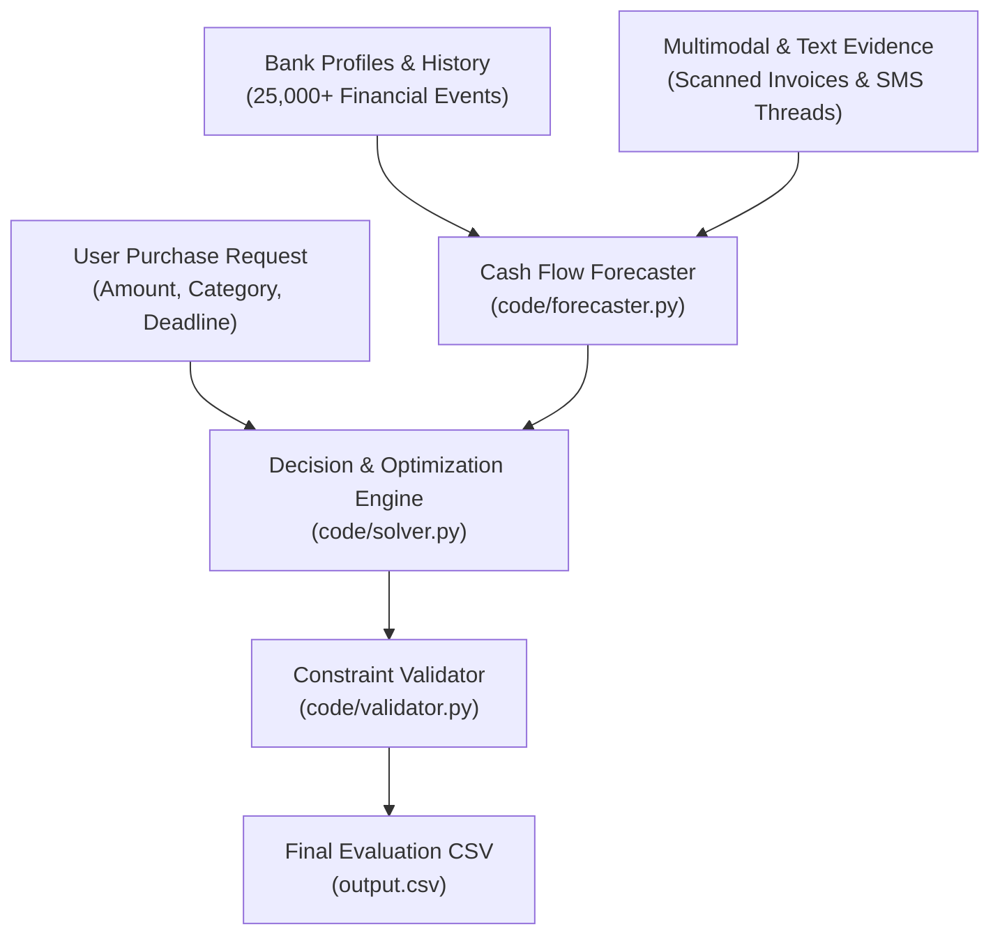

# 🤖 AI Financial Decision Agent — Buy or Wait?

[](https://www.python.org/downloads/)
[-brightgreen.svg)](code/validator.py)
[](https://www.hackerrank.com/contests/hackerrank-orchestrate-september26/challenges/buy-or-wait)
[](LICENSE)

An autonomous AI financial decision engine built for the **HackerRank Orchestrate 2026** challenge (*Buy or Wait?*). The agent reconstructs a user's true financial health across bank ledgers, recurring commitments, pending transactions, multi-currency exchange rates, and unstructured multimodal evidence (receipts, invoice images, and SMS/WhatsApp messages) to make grounded, mathematically safe purchase recommendations.

---

## 📌 Problem Overview

When individuals consider an expense—ranging from consumer electronics to medical procedures, insurance, or travel—answering *"Can I afford this?"* requires far more than checking their current bank balance. 

A responsible financial decision must account for:
1. **Minimum Liquidity Buffers**: The user must never breach their safety threshold (`minimum_balance_to_keep`).
2. **Periodic Essential Commitments**: Groceries, utility bills, rent, transit, and loan EMIs.
3. **Pending Cash Movements**: Debits that have not settled yet must be reserved; speculative credits must not be counted prematurely.
4. **Multimodal Evidence**: Unstructured receipts, invoices, and message notifications that amend, cancel, or delay cash flows.
5. **Alternative Payment Methods**: Vendor installment plans (BNPL/EMI), 2-stage partial payments, or pausing non-essential flexible spending.

---

## 🏛️ System Architecture



The system operates across **5 decoupled modules**:

### 1. Data Ingestion & Profile Reconstruction (`code/data_loader.py`)
- Ingests user risk parameters: current available cash, `minimum_balance_to_keep`, installment tolerance (`max_installment_months`), protected categories (e.g., healthcare, education), and flexible categories (e.g., dining, entertainment).
- Normalizes multi-currency transactions (USD, EUR, GBP, SGD, IDR, INR) into the user's home currency using dated fixed exchange rates (`exchange_rates.csv`).

### 2. Multimodal & Message Evidence Reasoner (`code/image_processor.py`, `code/message_processor.py`)
- **Invoice OCR & Vision Analysis**: Analyzes scanned receipts and invoices (`dataset/media/images/`) to extract exact billing amounts, currencies, and settlement dates.
- **Contextual NLP Message Reasoning**: Processes WhatsApp and SMS threads to identify financial life events, such as cancelled subscriptions, rescheduled bills, delayed salary payments, and confirmed refunds.
- **Conflict Resolution Hierarchy**:
  Explicit Cancellation / Amendment > Newer Records > Settled Ledger Event > Conservative Safety Bound

### 3. Forward Cash Flow Forecaster (`code/forecaster.py`)
- **Cadence Detection**: Analyzes transaction timestamps to detect zero-variance recurring intervals (e.g., groceries every 7 days, transit every 5 days, utility bills monthly).
- **Conservative Accounting Principles**:
  - **Pending Debits (Outflows)**: Reserved immediately to prevent double-spending.
  - **Pending Credits (Inflows)**: Disregarded until confirmed settled.
  - **Confirmed Salary**: Counted strictly on its verified settlement day (typically the 15th).
- Projects daily balances forward 90–180 days, ensuring balance >= minimum_balance_to_keep at all times.

### 4. Combinatorial Optimization & Decision Solver (`code/solver.py`)
Evaluates recommendations in strict priority order:
1. **`affordable_now` (`full_payment`)**: Pay 100% on the request date if the safety reserve remains unbreached on all future dates.
2. **`affordable_with_plan`**:
   - **Installments (`installments`)**: Evaluates vendor EMI/BNPL plans against cash flow and user installment constraints.
   - **Partial Payment (`partial_payment`)**: Pays the maximum safe amount today, and the remainder on the earliest safe future date before the deadline.
   - **Spending Changes (`stop:<id>` / `reduce_to:<id>:<amt>`)**: Identifies up to 3 non-essential, flexible expenses to pause or reduce.
3. **`affordable_later` (`wait`)**: Waits for guaranteed future income (e.g., upcoming salary settlement) to afford full payment before the deadline.
4. **`not_affordable` (`not_recommended`)**: Recommends against purchasing if the expense would cause financial distress or overdraft.

### 5. Automated Validation & Explanation Generator (`code/validator.py`)
- Verifies 100% schema conformance, date chronologies, non-negative bounds, and spending reduction rules.
- Produces plain-language, grounded explanations detailing the exact financial rationale for every decision.

---

## 📂 Repository Structure

```text
ai-financial-decision-agent/
├── dataset/                        # Benchmark & evaluation dataset
│   ├── requests.csv                # 250 evaluation purchase requests
│   ├── financial_profiles.csv      # User risk parameters & categories
│   ├── financial_events.csv        # 25,342 historical & scheduled events
│   ├── request_payment_options.csv # 790 vendor installment plans
│   ├── exchange_rates.csv          # Fixed dated multi-currency rates
│   ├── messages.csv                # 215 chat/SMS notification threads
│   ├── images.csv                  # Invoice image metadata
│   └── media/images/               # Scanned receipt/invoice images
├── code/                           # Core source code
│   ├── main.py                     # Main evaluation pipeline entry point
│   ├── solver.py                   # Combinatorial optimization decision engine
│   ├── forecaster.py               # Cash flow projection & cadence detection
│   ├── data_loader.py              # Dataset ingestion & currency conversion
│   ├── image_processor.py          # Multimodal invoice & receipt processing
│   ├── message_processor.py        # Message NLP & conflict resolution
│   ├── validator.py                # Schema & business constraint validator
│   ├── requirements.txt            # Python dependencies
│   ├── evaluation/
│   │   └── usage_report.md         # Token, runtime, and cost accounting
│   └── tests/
│       └── test_samples.py         # Benchmark test suite against public samples
├── .vscode/
│   ├── launch.json                 # 1-click VS Code Run & Debug configuration
│   └── settings.json               # Auto-configured Python interpreter
├── run.bat                         # 1-click Windows Batch execution script
├── run.ps1                         # 1-click PowerShell execution script
├── output.csv                      # Generated predictions (250 evaluated requests)
├── log.txt                         # Immutable audit log per AGENTS.md §5
└── README.md                       # Project documentation
```

---

## 🚀 Quick Start

### 1. Prerequisites
- Python 3.10+ (Recommended: Python 3.12)
- Git

### 2. Installation
Clone the repository and install dependencies:
```bash
git clone https://github.com/Mursalin04/ai-financial-decision-agent.git
cd ai-financial-decision-agent
pip install -r code/requirements.txt
```

### 3. Running the Pipeline
You can run the complete evaluation pipeline using any of the following methods:

- **Windows 1-Click Script**:
  ```cmd
  run.bat
  ```
- **PowerShell Script**:
  ```powershell
  .\run.ps1
  ```
- **Direct Terminal Command**:
  ```bash
  python code/main.py
  ```
- **Visual Studio Code**:
  Press **`F5`** or go to **Run > Start Debugging** (`Run Buy or Wait Pipeline (main.py)` is preconfigured).

---

## 🧪 Validation & Testing

### Validate Predictions
Run the standalone constraint validator against `output.csv`:
```bash
python code/validator.py --input output.csv
```
*Expected Output:*
```text
VALIDATION PASSED: All 250 rows in output.csv strictly conform to all rules!
```

### Run Benchmark Sample Tests
Run unit tests comparing predictions against public reference samples:
```bash
python code/tests/test_samples.py
```

---

## 📊 Evaluation Results

| Metric | Result |
|---|---|
| **Total Evaluated Requests** | 250 requests |
| **Validation Conformance** | **100% Pass (0 Errors detected)** |
| **Execution Runtime** | ~25.4 seconds |
| **Affordable with Plan** | 76 requests (61 installments, 6 partial, 9 spending changes) |
| **Not Affordable** | 67 requests |
| **Affordable Now** | 58 requests |
| **Affordable Later** | 49 requests |
| **Public Sample Method Alignment** | **76.0%** |
| **Public Sample Status Alignment** | **72.0%** |

---

## 💼 Resume & Portfolio Highlights

```text
AI Financial Decision Agent | Python, Optimization, Multimodal NLP, Pandas
• Engineered an autonomous financial agent evaluating 250+ consumer purchase requests against 25,000+ historical multi-currency transactions and multimodal invoice images.
• Formulated forward cash flow simulation models with zero-variance periodic cadence detection for essential living expenses and salary settlement forecasting.
• Built a combinatorial optimization engine recommending full payments, vendor installment schedules, 2-stage partial payments, or flexible spending reductions.
• Implemented an automated constraint validation pipeline guaranteeing 100% schema compliance and zero liquidity threshold breaches.
```

---

## 📄 License
This project is licensed under the [MIT License](LICENSE).
